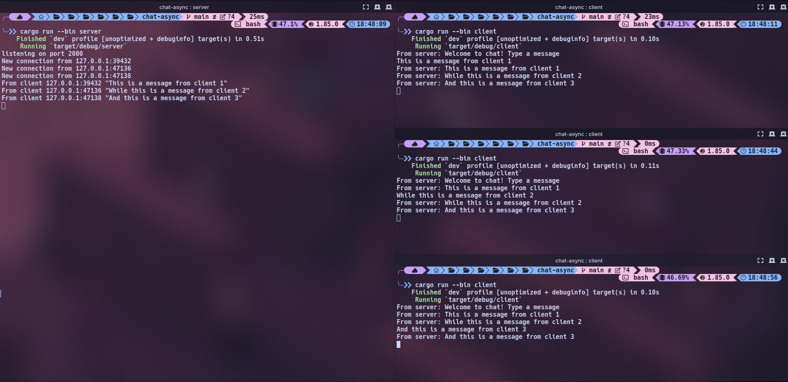
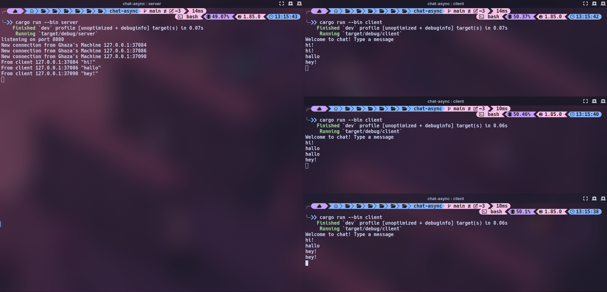

# Advanced Programming Module 9 - Timer Future
### Muhammad Ghaza Fadhlilbaqi - 2306173321

## Original code, and how it runs

How to run chat: Set up 4 terminals
- 1 terminal will be used as the server, run 
```bash
cargo run --bin server
```
- 3 terminals will be used as the clients, run 
```bash
 cargo run --bin client
 ```
After running, we can see from the screenshot above that when a client sends a message, the message will be received by the server, and then the message will be distributed to all clients connected to the server, including the client that sent the message. This happens because every client that connects to the server will be remembered by the server, and the server will wait until one of those clients sends a message to the server to be shared with all the clients connected to it.

## Modifying ports
To modify the port on the server, we need to change the ```TCPListener``` port number in the ```server.rs``` file. We also needed to change the port number in the ```client.rs``` file to match the server's port number. 

The websocket protocol on the server side is not declared explicitly. On the server code, the port is binded to a ```TCPListener``` that assigns a process to listen for any TCP connection going through that port, after a connection is established, the server then creates a socket that is then handed over to the websocket handler. So the server doesn't exactly declares it explicitly but its implementing the websocket protocol specs through the ```tokio-websocket``` crate.

## Small changes, add IP and Port

I made the changes on the server side, since the server already keeps track which message correspond to which address, that's because when the client first connects, a new asynchronous thread spawns that accepts a stream of messages from that particular client. Each client's host is assigned a thread and handler that is stored inside the ```addr``` arguments, this allows me to just insert the address on the message that is broadcasted back to the client.
